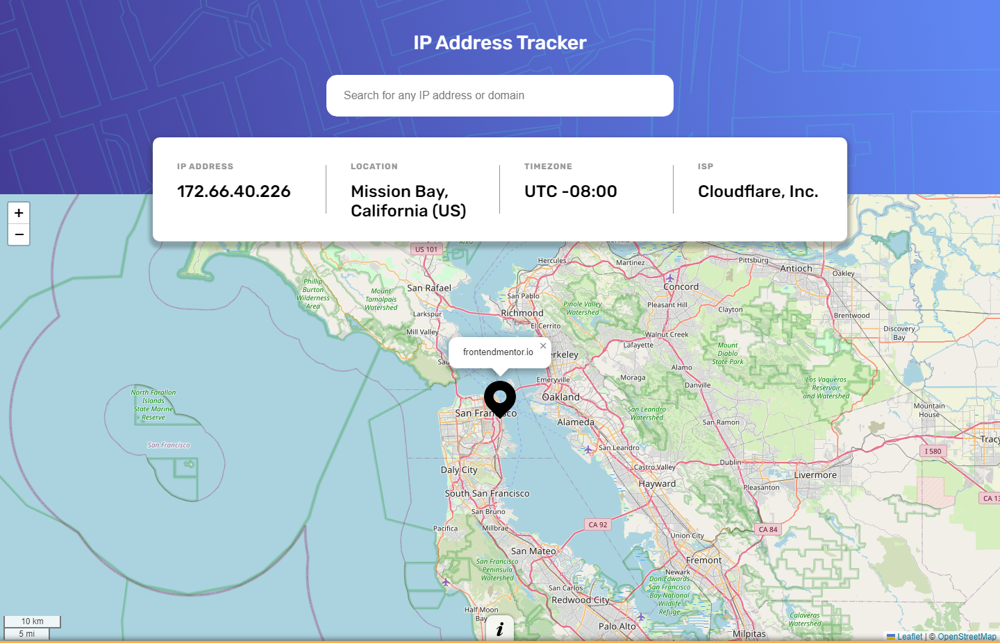

# Frontend Mentor - IP address tracker solution

This is a solution to the [IP address tracker challenge on Frontend Mentor](https://www.frontendmentor.io/challenges/ip-address-tracker-I8-0yYAH0). Frontend Mentor challenges help you improve your coding skills by building realistic projects.

## Table of contents

- [Overview](#overview)
  - [The challenge](#the-challenge)
  - [Screenshot](#screenshot)
  - [Links](#links)
- [My process](#my-process)
  - [Built with](#built-with)
  - [What I learned](#what-i-learned)
  - [Useful resources](#useful-resources)
- [Author](#author)

## Overview

### The challenge

Users should be able to:

- View the optimal layout for each page depending on their device's screen size
- See hover states for all interactive elements on the page
- See their own IP address on the map on the initial page load
- Search for any IP addresses or domains and see the key information and location

### Screenshot

### Links

- Solution URL: [Add solution URL here](https://your-solution-url.com)
- Live Site URL: [Add live site URL here](https://github.com/franexmo81/ip-address-tracker)

## My process

### Built with

- Semantic HTML5 markup
- CSS custom properties
- Flexbox
- Leaflet Maps and IP Geolocation APIs

### What I learned

- CSS Transitions
- DOM Manipulation
- JavaScript events handling
- API Fetch
- Async JavaScript functions

### Useful resources

- [W3Schools](https://www.w3schools.com/) - A must-go reference when it comes to know how a specific HTML tag or CSS property works.
- [MDN Web Docs](https://developer.mozilla.org/) - An open-source, collaborative project documenting Web platform technologies, including CSS, HTML, JavaScript, and Web APIs.
- [Leaflet Maps API documentation](https://leafletjs.com/reference.html/) - Documentation for the Leaflet Maps API.
- [IP Geolocation API documentation](https://geo.ipify.org/docs/) - Documentation for the IP Geolocation API.

## Author

- Website - [Fran Extremera](https://www.franextremera.com/)
- Frontend Mentor - [franexmo81](https://www.frontendmentor.io/profile/franexmo81)
- iCodeThis - [Fran](https://icodethis.com/Fran)
- LinkedIn - [Fran Extremera](https://www.linkedin.com/in/francisco-extremera/)
